<div align="center">

> Hello world! This is the project’s summary that describes the project plain and simple, limited to the space available.

**[PROJECT PHILOSOPHY](#philosophy) • [WIREFRAMES](#wireframes) • [TECH STACK](#stacks) • [IMPLEMENTATION](#implementation) • [HOW TO RUN?](#install)**

</div>

<br><br>


> waQoud is a utility app that calculates your trip costs and keeps you updated on the daily fluctuating gas prices.

### User Stories

-   As a user, I want to easily access the updated gas prices
-   As a user, I want to find out my trip costs according to the vehicle I am driving
-   As a user, I want to keep maintenance records of all my vehicles in one place
-   As a user, I want to know how many gas stations are around me and view their locations

<br><br>


> The design was implemented on Figma and logo was created on Canva

| <table>

  <tr>
    <td>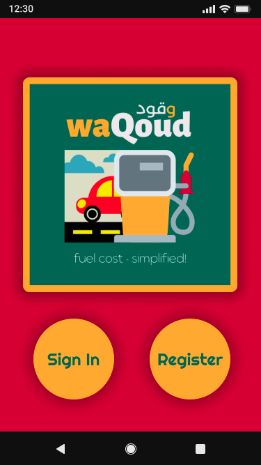</td>
    <td></td>
    <td>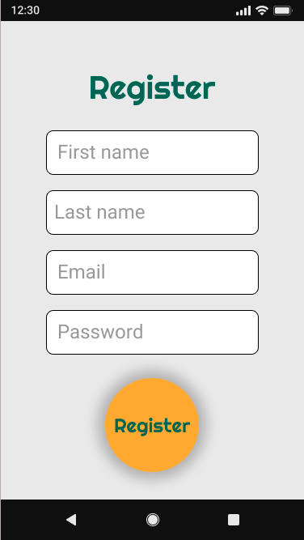</td>
    <td>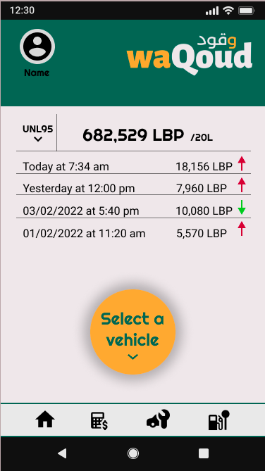</td>
    
  </tr>
  <tr>
    <td>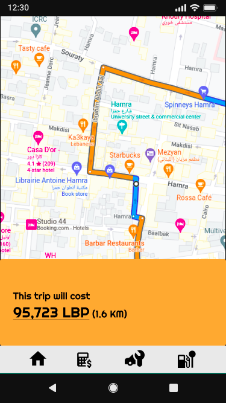</td>
    <td>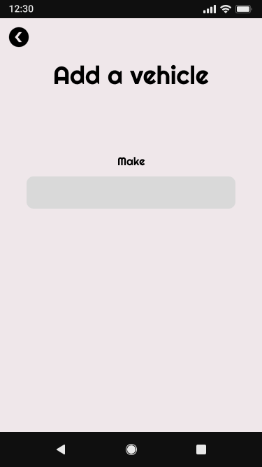</td>
    <td>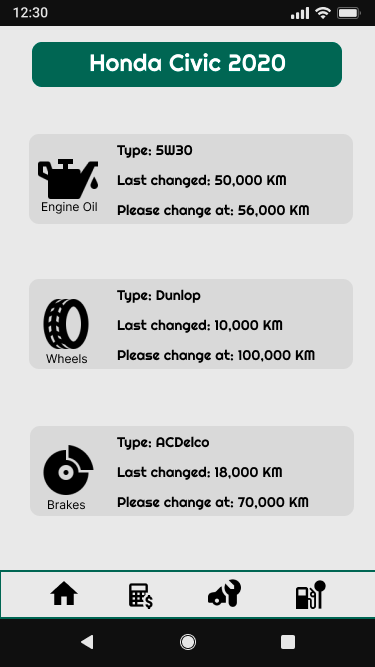</td>
    <td>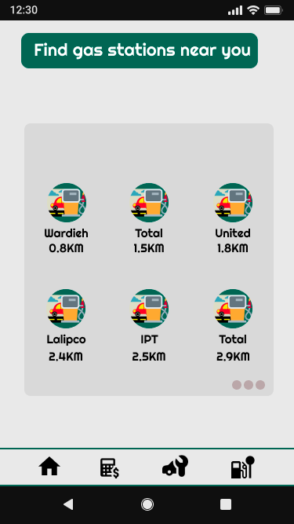</td>
  </tr>
</table>

<br><br>


Here's a brief high-level overview of the tech stack used to build waQoud:

-   This project uses the [React Native Framework](https://reactnative.dev/). React Native is a framework for building native apps using React. It can be used to develop applications that target anything from Android, iOS devices to Windows systems.
-   For reliability, the app uses [MySQL](https://www.mysql.com/) database with a firm structure to allow scalability.

-   The app uses the font [Righteous](https://fonts.google.com/specimen/Work+Sans) as its main font, and the design of the app adheres to the material design guidelines.

-   [React Native Maps](https://github.com/react-native-maps/react-native-maps) was used to allow user to pick destination and to view locations of gas stations nearby.

-   [Cars API](https://fonts.google.com/specimen/Work+Sans) was used to get necessary info about cars like mileage.

-   [Google Distance Matrix API](https://developers.google.com/maps/documentation/distance-matrix/overview) was used to calculate distance between two coordinates.

-   [Google Places API](https://developers.google.com/maps/documentation/places/web-service/overview) was used to get nearby gas stations, and for autocomplete to when searching places.

<br><br>


> Using the above mentioned tech stack and the wireframes built with Figma, the implementation of the app is shown as below (recordings from the real app)

| Register                           | Sign in                           | Gas Prices Chart                     |
| ---------------------------------- | --------------------------------- | ------------------------------------ |
| 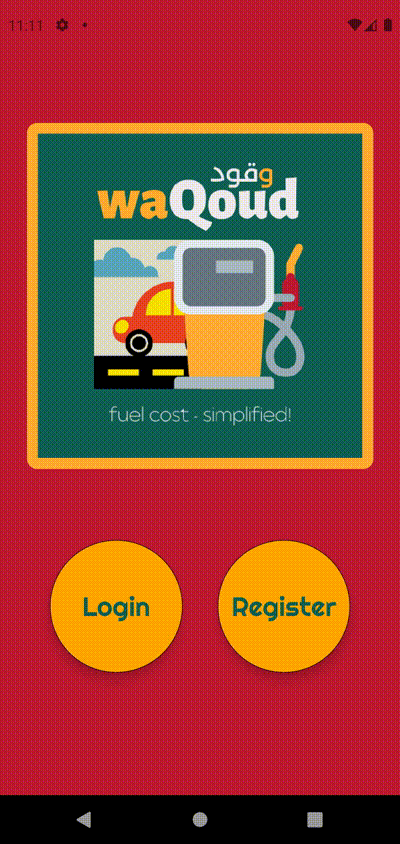 |  |  |

| Add a vehicle                         | Select a vehicle                    | Calculate Trip Cost by marker              |
| ------------------------------------- | ----------------------------------- | ------------------------------------------ |
|  | 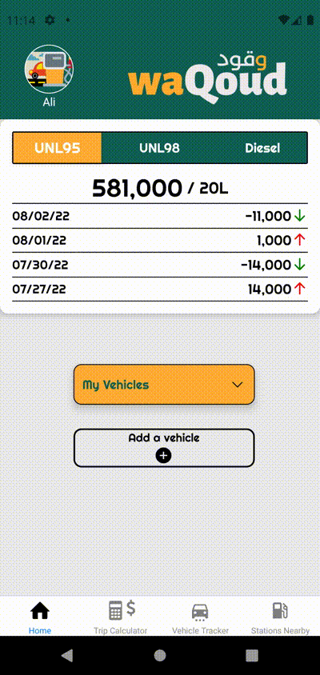 | 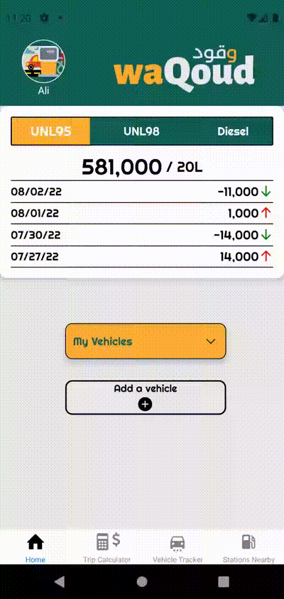 |

| Calculate Trip Cost by Search                     | Vehicle Tracker                     | Gas Station Nearby                                |
| ------------------------------------------------- | ----------------------------------- | ------------------------------------------------- |
| 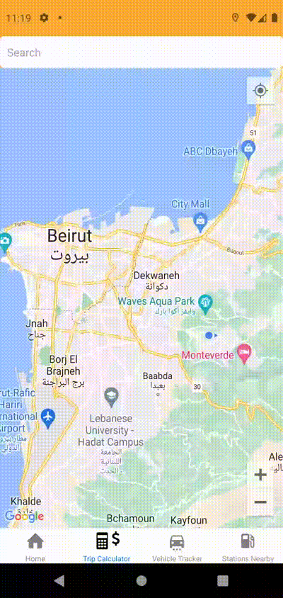 | 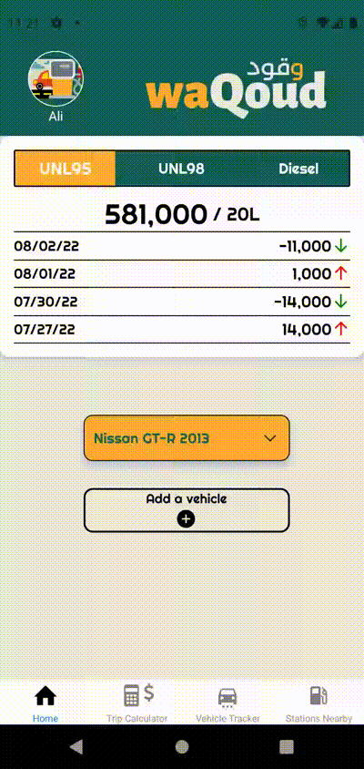 | 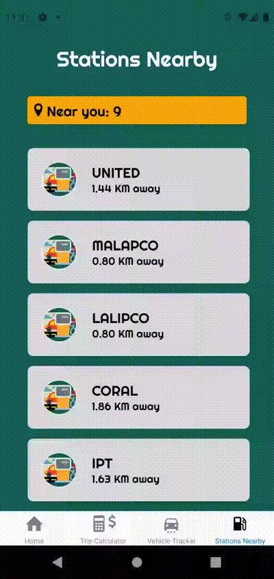 |

<br><br>


> This is an example of how you may give instructions on setting up your project locally.
> To get a local copy up and running follow these simple example steps.

### Prerequisites

This is an example of how to list things you need to use the software and how to install them.

-   Download and install [Node.js](https://nodejs.org/en/)

-   npm
    ```sh
    npm install npm@latest -g
    ```
-   Expo CLI
    ```sh
    npm install --global expo-cli
    ```
-   Expo Go mobile app

### Installation

1. Clone the repo
    ```sh
    git clone https://github.com/ali-shehab94/waQoud-app.git
    ```
2. Navigate to the Frontend folder and install dependencies
    ```sh
    cd waQoud-app/front-end
    npm install
    ```
3. Run the start up command
    ```sh
    expo start
    ```
4. Scan the generated QR code with your camera (ios) or through the Expo Go application (android).
